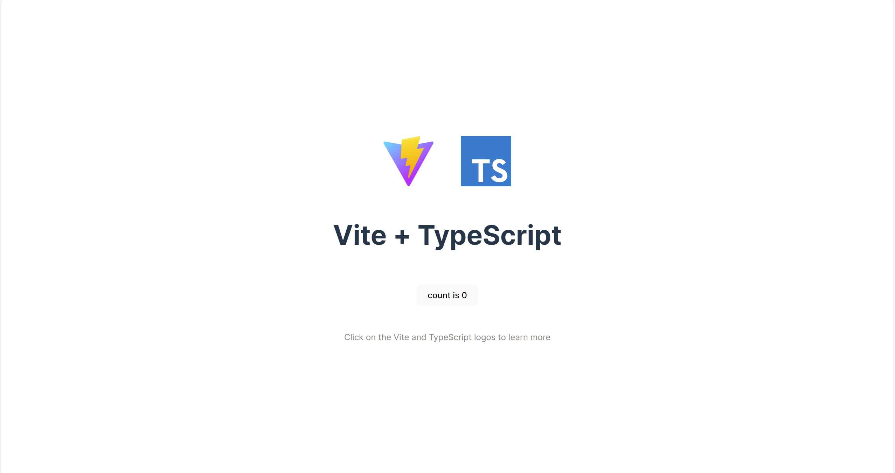

# Basic Diffusion Studio Core Tutorial

In many instances, we need to create many videos that are very similar, but with some slight but crucial differences. For example, a marketing agency might want to send out personalized videos on the birthday of every client. They have a standard template but want to add the name and a custom coupon to each personalized video. Obviously, they want to create the videos automatically using a script.
Diffusion Studio core is perfect for these use cases. 

In this tutorial, I will give you a quick introduction into how you can use the Diffusion Studio Core to programmatically generate your own videos.

## Prerequisits

Diffusion Studio Core is a Javascript package that needs to be run in the browser such that it has access to the browser APIs.
Therefore, we need to first create a simple website to run Javascript in. For simplicity, I use `vite` to set this up.
```
npm create vite@latest basic-tutorial-diffusion-studio-core -- --template vanilla-ts
```
Now, that we have that, we can install the Diffusion Studio Core package:
```
cd basic-tutorial-diffusion-studio-core
npm i @diffusionstudio/core
```
You can start the development server with `npm run dev` and should see something like this:


## Basics 

Before we start with Diffusion Studio, let's clean up some stuff that we do not need.
You can delete the `counter.ts` file and delete all the code in the `main.ts` file.
You can also delete the TypeScript SVG icon.

Now, let's add some basic code for a hello world application:
```TypeScript
import { TextClip, Composition, WebcodecsEncoder } from '@diffusionstudio/core';

const composition = new Composition();

const text = new TextClip('Hello World');

await composition.appendClip(text);

await new WebcodecsEncoder(composition).export();
```
Once you refresh the page, your browser will download a `video.mp4` file. If you watch the video, you should see a static `Hello World` text. 
Pretty basic, but we just programmatically generated our first video and everything was run in you local browser.
```TypeScript
import { TextClip, Composition, WebcodecsEncoder } from '@diffusionstudio/core';

const composition = new Composition(); ①

const text = new TextClip('Hello World');
await composition.add(text); ②

await new WebcodecsEncoder(composition).export(); ③
```
To start a video, you have to create a composition ①. The composition object manages the video and is used to store all components related to the video.
In ②, a `TextClip` is generated and appended to the composition. If you have read the documentation, you probably stumbled onto tracks which are needed
for adding any clip. The `appendClip` function creates a new track with the clip and adds it to the composition. Finally, the composition is encoded using [webcodecs](https://developer.mozilla.org/en-US/docs/Web/API/WebCodecs_API) and exported in ③.

## Video Player

To improve the development speed, we can add a video player to the scene. For that, we first need to add the following to the `index.html` file:
```HTML
<div id="player-container">
  <div id="player"></div>
</div>
```
Your `index.html` should look like this now:
```HTML
<!doctype html>
<html lang="en">
  <head>
    <meta charset="UTF-8" />
    <link rel="icon" type="image/svg+xml" href="/vite.svg" />
    <meta name="viewport" content="width=device-width, initial-scale=1.0" />
    <title>Vite + TS</title>
  </head>
  <body>
    <div id="app">
      <div id="player-container">
        <div id="player"></div>
      </div>
    </div>
    <script type="module" src="/src/main.ts"></script>
  </body>
</html>
```
Additionally, we need to add the player and the composition in the `main.ts`script:
```TypeScript
const container = document.getElementById('player-container') as HTMLDivElement;
const player = document.getElementById('player') as HTMLDivElement;
 
composition.attachPlayer(player);
 
const scale = Math.min(
  container.clientWidth / composition.width,
  container.clientHeight / composition.height,
);
 
player.style.width = `${composition.width}px`;
player.style.height = `${composition.height}px`;
player.style.transform = `scale(${scale})`;
player.style.transformOrigin = 'center';

composition.play();
```
If you relaod the scene, you will now see the player on the screen with the hello world text.

## Animation
So far, we have only added a static text, and nothing has been animated yet. So, let's add a simple animation.
```TypeScript
const text = new TextClip({
    text: 'Hello World', ①
    textAlign: 'center',
    position: {
        x: new Keyframe( ②
            [0, 100],
            [-30, 970/2],
            {easing: 'easeIn'}
        ),
        y: 540/2,
    },
});
```
The only thing that we have to change is the `TextClip` to animate it. First, we have to add a `TextClipProps` object instead of directly using a string as the input. The text attribute ① of the properties object is the text that gets rendered. We now can also add a position, which consists of x and y coordinates, both of which can be animated. To make the text slide in, we need to add a keyframe (②). In the `Keyframe`, we set the start and end frames and then the range of the position we are animating. Finally, we can define the animation type. 
```TypeScript
new Keyframe(
    [0, 100], // start and end frame
    [-30, 970/2], // range of values that are being animated
    {easing: 'easeIn'} // animation type
)
```
The keyframe can be applied to position, translation, rotation, and opacity (to find out more about keyframes, see [here](https://docs.diffusion.studio/learn/1-keyframe)). Let's do another animation and add a rotation animation:
```TypeScript
rotation: new Keyframe(
    [100, 200, 201, 300],
    [0, 3600, 0, 360],
    {type: 'degrees'}
)
```
Now you can see that you can add as many values to the keyframe as you like, as long as the lenght of the frame array is the same as the value array. You might notice that the rotation looks a little off. It seems like the rotation anchor is at the tip of the W. This is because of the position attributes. To fix this we need to set the position as center (`position: 'center'`). That will set the anchor of the rotation to the center of the phrase and make the rotation seem more normal.